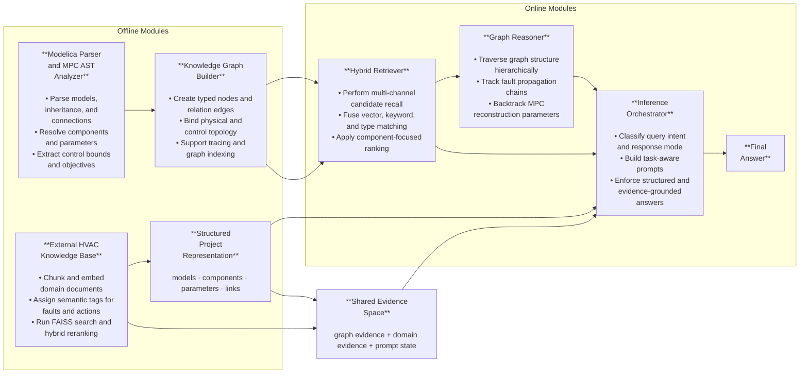

```mermaid
flowchart LR
    %% =========================
    %% Title-equivalent structure
    %% =========================

    subgraph OFF["Offline Modules"]
        direction LR

        A["**Modelica Parser<br/>and MPC AST<br/>Analyzer**<br/><br/>• Parse models,<br/>inheritance, and<br/>connections<br/>• Resolve components<br/>and parameters<br/>• Extract control bounds<br/>and objectives"]

        B["**Knowledge Graph<br/>Builder**<br/><br/>• Create typed nodes and<br/>relation edges<br/>• Bind physical and<br/>control topology<br/>• Support tracing and<br/>graph indexing"]

        C["**External HVAC<br/>Knowledge Base**<br/><br/>• Chunk and embed<br/>domain documents<br/>• Assign semantic tags for<br/>faults and actions<br/>• Run FAISS search and<br/>hybrid reranking"]

        D["**Structured<br/>Project<br/>Representation**<br/><br/>models · components · parameters · links"]
    end

    subgraph ON["Online Modules"]
        direction LR

        E["**Hybrid Retriever**<br/><br/>• Perform multi-channel<br/>candidate recall<br/>• Fuse vector, keyword,<br/>and type matching<br/>• Apply component-focused<br/>ranking"]

        F["**Graph Reasoner**<br/><br/>• Traverse graph structure<br/>hierarchically<br/>• Track fault propagation<br/>chains<br/>• Backtrack MPC<br/>reconstruction parameters"]

        G["**Inference<br/>Orchestrator**<br/><br/>• Classify query intent<br/>and response mode<br/>• Build task-aware<br/>prompts<br/>• Enforce structured and<br/>evidence-grounded<br/>answers"]

        H["**Final<br/>Answer**"]
    end

    I["**Shared Evidence<br/>Space**<br/><br/>graph evidence + domain evidence + prompt state"]

    %% =========================
    %% Connections
    %% =========================

    A --> B


    C --> D
    C --> I

    B --> E
    B --> E
    E --> F

    E --> G
    F --> G

    D --> G
    D --> I

    I --> G
    G --> H
  
```